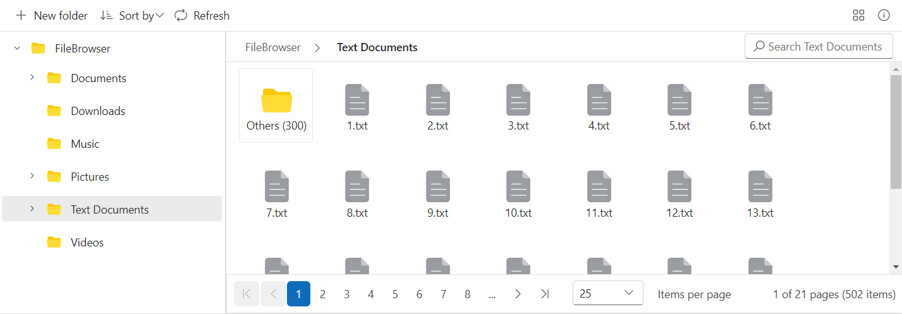

---
layout: post
title: Pagination in Blazor FileManager Component | Syncfusion
description: Checkout and learn here all about Pagination in the Syncfusion Blazor FileManager component and more.
platform: Blazor
control: File Manager
documentation: ug
---

# Pagination in Blazor File Manager Component

Pagination in the Blazor File Manager component optimizes the performance and user experience by loading only a specified number of files and folders per page. This feature significantly improves performance when managing large datasets, reducing load times and enhancing interaction.

## Enabling Pagination

To enable pagination in the File Manager, set the [AllowPaging](https://help.syncfusion.com/cr/blazor/Syncfusion.Blazor.FileManager.SfFileManager-1.html#Syncfusion_Blazor_FileManager_SfFileManager_1_AllowPaging) property to `true`. This enables pagination for both details view and large icons view, ensuring efficient navigation and file management across various display modes.

## Page Size Configuration

The [FileManagerPageSettings](https://help.syncfusion.com/cr/blazor/Syncfusion.Blazor.html) component's `PageSizes` property enables a dropdown in pager that allows you to dynamically change the number of records displayed in the current page. `PageSize` property allows number of items to be loaded in a single page. Here files are sorted using [Custom sorting](https://blazor.syncfusion.com/documentation/file-manager/file-operations#custom-sorting).

The `NumericItemsCount` property is used to control the number of numeric buttons displayed in the pager when pagination is enabled. These buttons allow users to directly navigate to a specific page in the File Manager.

Here is a sample demonstrating Pagination enabled in the File Manager.

```cshtml

@using Syncfusion.Blazor.FileManager

    <SfFileManager TValue="FileManagerDirectoryContent" AllowPaging="true" Path="/Text Documents/" SortComparer="new NaturalSortComparer()">
        <FileManagerAjaxSettings Url="https://ej2-aspcore-service.azurewebsites.net/api/Virtualization/FileOperations"
                                 UploadUrl="https://ej2-aspcore-service.azurewebsites.net/api/Virtualization/Upload"
                                 DownloadUrl="https://ej2-aspcore-service.azurewebsites.net/api/Virtualization/Download"
                                 GetImageUrl="https://ej2-aspcore-service.azurewebsites.net/api/Virtualization/GetImage">
        </FileManagerAjaxSettings>
        <FileManagerPageSettings PageSize="25" NumericItemsCount="8" PageSizes="@(new List<int>(){10,25,50})"></FileManagerPageSettings>
    </SfFileManager>

```

Below is a screenshot illustrating the pagination feature in the File Manager component, showing how files and folders are displayed with paginated controls:



## Pagination with Pager Template in Blazor File Manager

The Blazor File Manager component allows you to customize the pagination controls using a pager template. This enables the display of custom content in the pagination area, such as buttons or other UI elements, to enhance user interaction.

## Adding a Pager Template

The `Template` property in the `FileManagerPageSettings` allows you to insert custom UI elements, such as buttons into the pager control. This offers greater flexibility and customization for the paging interface. I

To implement the [GoToPageAsync](https://help.syncfusion.com/cr/blazor/Syncfusion.Blazor.FileManager.SfFileManager-1.html#Syncfusion_Blazor_FileManager_SfFileManager_1_GoToPageAsync) method within the pager template for the Blazor File Manager component, you can allow users to navigate to a specific page by passing the page number to the method. 

Below is an example showing how to integrate the [GoToPageAsync](https://help.syncfusion.com/cr/blazor/Syncfusion.Blazor.FileManager.SfFileManager-1.html#Syncfusion_Blazor_FileManager_SfFileManager_1_GoToPageAsync) method in the pager template.
````cshtml
@using Syncfusion.Blazor.FileManager;
@using Syncfusion.Blazor.Navigations;
<SfFileManager @ref="fileManager" TValue="FileManagerDirectoryContent" AllowPaging="true">
<SfFileManager @ref="fileManager" TValue="FileManagerDirectoryContent" AllowPaging="true">
<SfFileManager @ref="fileManager" TValue="FileManagerDirectoryContent" AllowPaging="true">
    <FileManagerAjaxSettings Url="https://ej2-aspcore-service.azurewebsites.net/api/Virtualization/FileOperations"
                             UploadUrl="https://ej2-aspcore-service.azurewebsites.net/api/Virtualization/Upload"
                             DownloadUrl="https://ej2-aspcore-service.azurewebsites.net/api/Virtualization/Download"
                             GetImageUrl="https://ej2-aspcore-service.azurewebsites.net/api/Virtualization/GetImage">
    </FileManagerAjaxSettings>
    <FileManagerEvents TValue="FileManagerDirectoryContent" PageChanging="OnChanging" PageChanged="OnChanged"></FileManagerEvents>
    <FileManagerPageSettings PageSize="3">
        <Template>
            <button @onclick="NavigateToPage">Go To Page 2</button>
        </Template>
    </FileManagerPageSettings>
</SfFileManager>
@code {
    SfFileManager<FileManagerDirectoryContent> fileManager;
    
    
    public void OnChanging(PageChangingEventArgs args)
    {
 
    }
    public void OnChanged(PageChangedEventArgs args)
    {
 
    }
    
    private async Task NavigateToPage()
    { 
        await fileManager.GoToPageAsync(2);
    }
}

````

The screenshot below shows the Blazor File Manager component with a custom pagination button integrated using the `GoToPageAsync` method.

